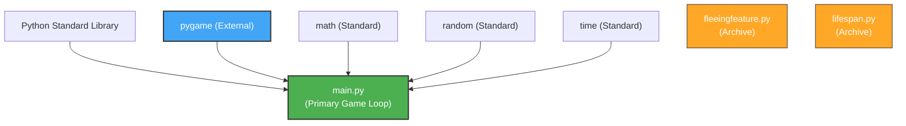
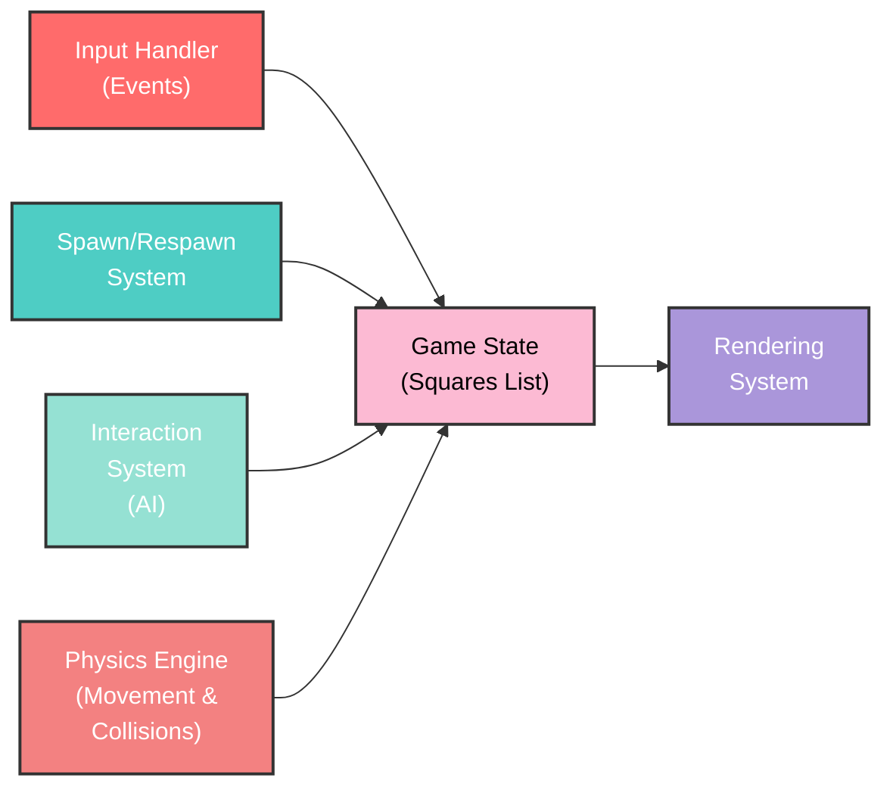
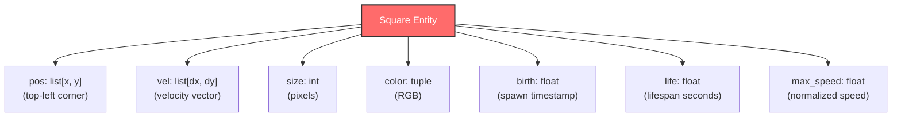
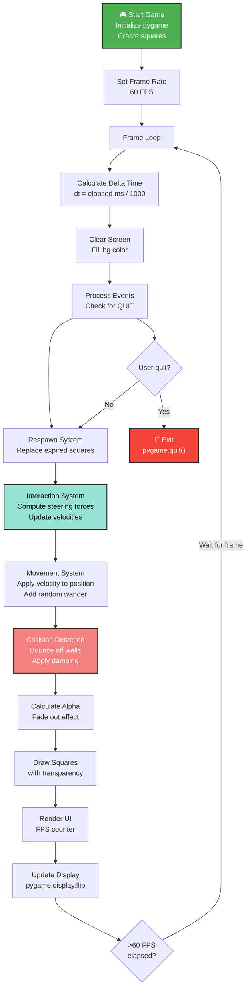
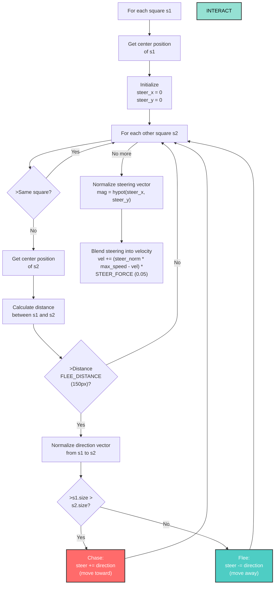
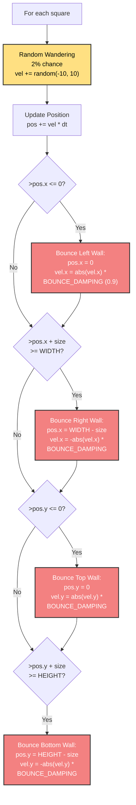
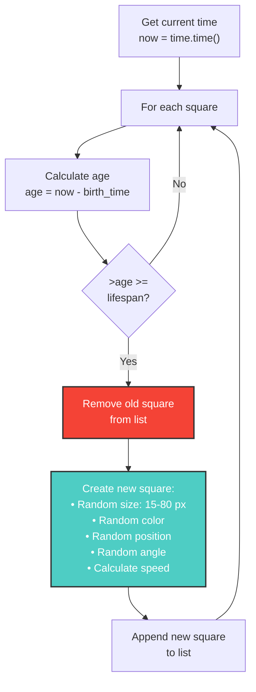
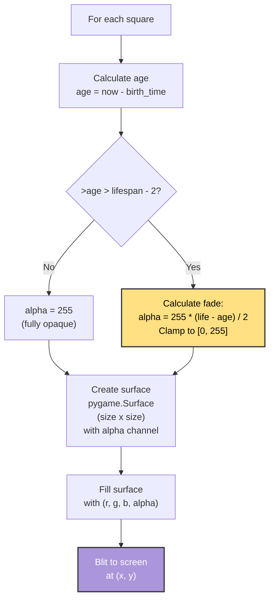
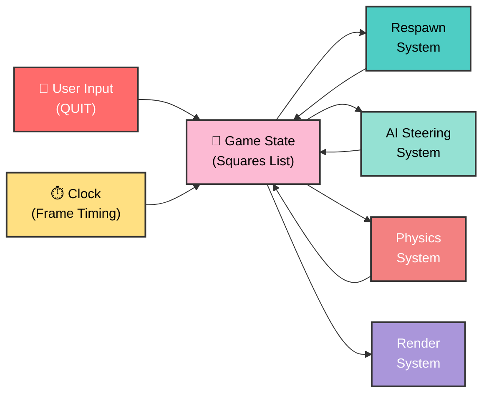

# Pygame Squares Animation - Architecture Documentation

## Overview
A pygame-based animation system featuring multiple moving squares with AI-driven behavior (fleeing and chasing), lifespan management, physics simulation, and wall collisions. The program runs at 60 FPS with real-time rendering.

---

## 1. Module Dependency Graph

---

## 2. High-Level System Architecture

---

## 3. Square Data Structure

Each square in the `squares` list is a dictionary containing:

---

## 4. Main Game Loop Execution Flow

---

## 5. Interaction System (AI Steering)

The AI behavior determines how squares move relative to each other based on size comparison.

---

## 6. Physics System (Collision & Movement)

---

## 7. Lifespan & Respawn System

---

## 8. Rendering Pipeline

---

## 9. Key Configuration Constants

| Constant | Value | Purpose |
|----------|-------|---------|
| `NUM_SQUARES` | 15 | Initial number of squares |
| `FLEE_DISTANCE` | 150 px | Distance at which squares react |
| `STEER_FORCE` | 0.05 | Steering intensity (0-1 blend factor) |
| `BOUNCE_DAMPING` | 0.9 | Energy retained after wall collision |
| `COLORS` | RGB tuples | 4 available colors for squares |
| `WIDTH, HEIGHT` | 800, 600 | Screen dimensions |
| `Target FPS` | 60 | Frame rate (clock.tick) |
| `Size range` | 15-80 px | Square size randomization |
| `Lifespan range` | 12-18 s | Square lifetime before respawn |

---

## 10. Entry Point & Initialization

**File:** `main.py`

**Initialization Sequence:**
1. Import libraries: `pygame`, `random`, `math`, `time`
2. Initialize pygame: `pygame.init()`
3. Create display window (800x600)
4. Set window caption
5. Populate `squares` list with 15 randomly configured squares
6. Create game clock (60 FPS target)
7. Create font for UI
8. Enter main game loop

---

## 11. Data Flow Diagram

---

## 12. Code Sections Breakdown

| Section | Location | Responsibility |
|---------|----------|-----------------|
| **Initialization** | Lines 1-55 | Pygame setup, square creation, constants |
| **Main Loop Setup** | Lines 56-62 | Game state & timing initialization |
| **Event Handling** | Lines 65-68 | Input and quit event processing |
| **Respawn System** | Lines 70-86 | Lifespan tracking and square replacement |
| **Interaction System** | Lines 88-131 | AI steering (chase/flee behavior) |
| **Movement & Physics** | Lines 133-173 | Velocity application, wall bouncing, damping |
| **Rendering** | Lines 175-193 | Square drawing with fade effect, UI text |
| **Display Update** | Line 195 | Frame buffer swap |
| **Cleanup** | Line 197 | Pygame shutdown |

---

## Summary

This pygame animation system demonstrates:
- **Object-oriented simulation** using dictionary-based entity storage
- **AI behavior** through steering forces and size-based interaction rules
- **Physics simulation** including velocity, collision detection, and damping
- **Lifespan management** with time-based entity respawning
- **Real-time rendering** with transparency and fade effects
- **Modular game loop** separating input, update, and render phases

The architecture is suitable for educational purposes and demonstrates fundamental game engine concepts in ~200 lines of Python.
